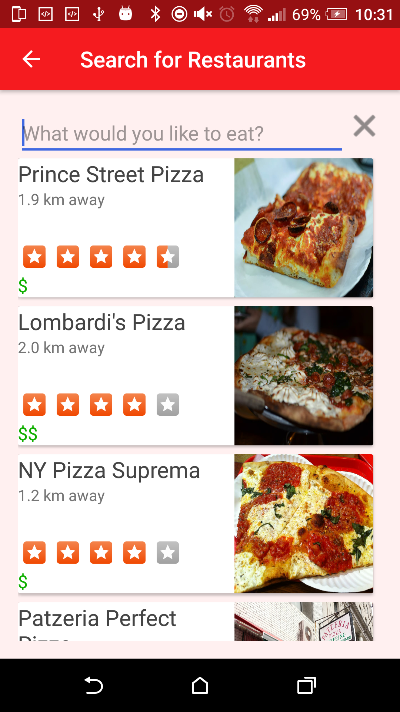

## Restaurant Roulette

**Restaurant Roulette**  enables users to discover local businesses in cool and fun ways.  The app has access to the **Yelp API** which allows the user to view businesses and give opportunities to discover new places.  The user is able to find places by entering what they would like to eat.  The Roulette feature allows users to find a mysterious place providing only an address.  The Date night feature allows users to plan a date out on the town with their significant other.  Businesses can also be shared via Twitter.  An Uber Estimate calculates how much an Uber cab would charge to go to the location and varies based on distance between the user location and the location of the business.

**Features:**
 
- Quick Pick
- Roulette
- Date Night
- Notifications
- Share via Twitter
- Uber Estimate

**Bugs:**

- Accessing the MapActivity in landscape mode causes the app to crash
- Uber Estimate can take a while to show on Detail Activity and Roulette

**Links**

- [Research Plan](https://docs.google.com/document/d/127VDPjg9w96fkXgNkOOlcfigmeXD1exO6DcEwZygYh0/edit)
- [Competitive Reaserch](https://docs.google.com/spreadsheets/d/1wS7SbcI1JEKh87mHkrWMn4y4WdXAh9ZlHt8-UvtAR-E/edit#gid=0)
- [User Persona](https://docs.google.com/document/d/1bfPbPumb89SfdUyAas1zJjTSFx-N7wqhhX47w88BoVU/edit?usp=sharing)
- [User Stories](https://docs.google.com/document/d/11D-DCgPUMWaPXAfLmGSy1ry1SP9jKV0HQflYUZGzjCo/edit)
- [Trello Board](https://trello.com/b/bWCV04wH/team-yelp-project-3-board)

**Screenshots**

  
  
  
  
  
  

 
